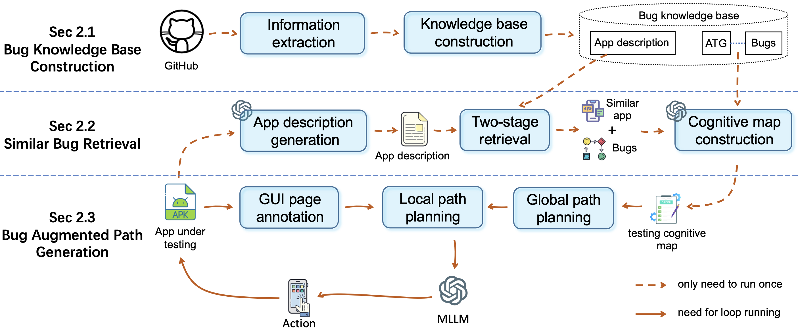

# BugHunter: Bug-Aware Automated GUI Testing via Retrieval Augmentation

## Overview

BugHunter is a novel bug-aware automated GUI testing approach that leverages Large Language Models (LLMs) and Retrieval-Augmented Generation (RAG) to generate exploration paths guided by bug reports from similar apps. This method aims to increase bug detection efficiency by dynamically adapting the testing process to target bug paths, rather than focusing solely on coverage.

Here is the overview structure of BugHunter:



Here is our youtube video:

[](https://www.youtube.com/watch?v=C0EgbLVi9uw)

Here is the demo gif:


## Key Features
- Bug Knowledge Base: Constructs a high-quality bug knowledge base from historical bug reports.
- Two-Stage Retrieval: Retrieves relevant bug reports using a two-stage retrieval process.
- Path Generation: Generates test paths based on bug reports from similar apps.
- Local and Global Path Planning: Handles differences in functionality and UI design across apps.
- Efficient Bug Detection: Increases bug detection efficiency by targeting bug paths.

## Modules

1. Knowledge Base Construction
Extracts information from open-source apps and their bug reports.
Maps bug reports to the Activity Transition Graph (ATG) to form a structured knowledge base.
2. Similar Bug Retrieval
Uses a two-stage retrieval process to identify relevant bug reports.
Builds a test cognition graph to map similar app bug reports to the target app's ATG.
3. Bug-Augmented Path Generation
Annotates GUI screenshots to help LLMs interpret GUI elements accurately.
Uses local and global path planning to adapt bug-triggering steps to the target app's specific GUI layout.

## Implementation

BugHunter is implemented as a fully automated GUI testing tool, utilizing GPT-4 Vision for text and visual information processing, UIAutomator for GUI view hierarchy extraction, and BCEmbedding for similarity search and matching. The system is built on VirtualBox, Python pyvbox, and Android Debug Bridge (ADB).

## Experiments

### Research Questions
- RQ1: Evaluates BugHunter's effectiveness in detecting bugs and achieving test coverage compared to common and state-of-the-art baseline methods.
- RQ2: Ablation studies to evaluate the contribution of each sub-module to coverage and bug detection performance.
- RQ3: Assesses BugHunter's practicality by automatically exploring apps on Google Play and detecting unseen bugs.

### Datasets

- RQ1 & RQ2: 71 apps and 121 bugs from [Themis benchmark](https://github.com/the-themis-benchmarks/home) and [F-Droid](https://f-droid.org/).

    The dataset for this study consists of 71 applications with a total of 121 crash bugs. The applications are sourced from two main datasets: 20 applications with 34 bugs from the Themis benchmark, and an additional 51 applications with 87 bugs collected from F-Droid.

    You can download the additional added dataset in [google drive](https://drive.google.com/drive/folders/1vjCY1Tr6Tp_QctP_KpbeCb7-erTJn_-N?usp=sharing).
    Here are the relevant statistics for this part of the data:

    | App categories | max activities | min activities | Median activities |
    |-----------------|----------------|----------------|--------------------|
    | 12             | 39             | 2              | 16                |

- RQ3: 237 popular apps randomly selected from Google Play. Here are the relevant statistics for this part of the data:

    | App categories | max activities | min activities | Median activities |
    |-----------------|----------------|----------------|--------------------|
    | 20             | 77             | 8              | 31                |


### Baseline Methods

Includes 16 common and state-of-the-art automated GUI testing techniques categorized into random/rule-based, model-based, and learning-based methods.

### Results

#### Bug Detection Performance (RQ1)

BugHunter detected 121 bugs in 71 apps with a recall rate of 64%, 20% higher than the best baseline method (GPTDroid).
Achieved 53% activity coverage and 52% code coverage, comparable to the best baseline.

#### Ablation Study (RQ2)

Removing the similar bug retrieval module and augmented path generation module reduced the bug detection recall rate by 50% and 51%, respectively.

#### Practicality (RQ3)

BugHunter detected 49 new crash bugs in 273 apps on Google Play, with 33 fixed, 9 confirmed by developers, and 7 pending feedback.

##### Confirmed Bugs

| ID | App name | Category | download | Version | Time-Machine | ComboDroid | APE+QT | Humanoid | GPTDroid |
|----|----------|----------|----------|---------|--------------|------------|---------|----------|----------|
| 1  | BOM Weather | weather | 1M+ | 6.9.1 |  |  |  |  |  |
| 2  | Weawow | weather | 5M+ | 6.2.8 |  |  |  |  |  |
| 3  | To-Do List | productivity | 10M+ | 10.3 |  |  |  |  |  |
| 4  | Roubit | productivity | 1M+ | 6.1.3 |  |  |  | ✅ |  |
| 5  | Bitget | finance | 5M+ | 2.41.3 |  |  |  |  |  |
| 6  | Tonkeeper | finance | 10M+ | 4.10.0 |  |  |  |  |  |
| 7  | Mi Fitness | health | 10M+ | 3.30.0 |  |  |  |  |  |
| 8  | Fitdays | health | 1M+ | 1.22.2 |  | ✅ |  |  |  |
| 9  | Tasty | food | 10M+ | 1.97.0 |  |  |  |  |  |


##### Pending Bugs

| ID | App name       | Category | download | Version  | Time-Machine | ComboDroid | APE+QT | Humanoid | GPTDroid |
|----|---------------|----------|----------|----------|--------------|------------|---------|----------|----------|
| 1  | DoorDash      | food     | 50M+     | 15.18    |               |            |         |          |          |
| 2  | Daily Meal Planner | food     | 100K+    | 2.5.0    |               |            |         |          |          |
| 3  | Mindbody      | health   | 5M+      | 7.73.0   |               |            |         |          |          |
| 4  | FX File Explorer | business | 10M+     | 12.3     |               |            |         |          |          |
| 5  | App Sharer    | tool     | 10K+     | 1.0.4    |               |            |         |          |          |
| 6  | Send Anywhere  | productivity | 10M+     | 23.2.6   |               |            |         |          |          |
| 7  | Sportplan     | sport    | 50K+     | 3.0.38   |               |            |         |          |          |

##### Fixed Bugs

| ID | App name | Category | Download | Version | TimeM | Comb | APE+QT | Humanoid | GPTDroid |
|-------------|-------------------|-------------------|-------------------|------------------|----------------|---------------|-----------------|-------------------|-------------------|
| 1           | Musixmatch        | music             | 50M+              | 7.10.1           |                |               |                 |                   |                   |
| 2           | Time Planner      | productivity      | 5M+               | 3.22             | ✅     | ✅    | ✅      |                   | ✅        |
| 3           | DailyLife         | lifestyle         | 5M+               | 4.3.0.2          |                |               |                 |                   |                   |
| 4           | Carousell         | shopping          | 10M+              | 2.370.4          |                |               |                 |                   |                   |
| 5           | Hungerstation     | food              | 10M+              | 8.0.19           |                |               |                 |                   |                   |
| 6           | Karrot            | social            | 10M+              | 24.33.0          |                |               |                 |                   |                   |
| 7           | Khan Academy      | education         | 10M+              | 8.1.0            |                |               |                 |                   |                   |
| 8           | Klook             | travel            | 10M+              | 7.3.1            | ✅     |               | ✅      | ✅        | ✅        |
| 9           | Money Manager     | finance           | 10M+              | 4.9.18           |                |               |                 |                   |                   |
| 10          | Musicolet         | music             | 10M+              | 11.3             |                |               |                 |                   |                   |
| 11          | Notion            | productivity      | 10M+              | 0.6.2419         |                |               |                 |                   |                   |
| 12          | Ringtones         | entertain         | 10M+              | 3.7.1            |                | ✅    |                 |                   | ✅        |
| 13          | School Planner    | education         | 10M+              | 8.2.1            | ✅     |               | ✅      | ✅        | ✅        |
| 14          | ShortMax          | entertain         | 10M+              | 1.9.1            |                |               |                 |                   |                   |
| 15          | Step Tracker      | health            | 10M+              | 1.4.7            |                |               |                 |                   |                   |
| 16          | To-Do List        | productivity      | 10M+              | 3.7.1            |                | ✅    |                 |                   |                   |
| 17          | Transit           | map               | 10M+              | 5.15.1           |                |               |                 |                   |                   |
| 18          | Zepp              | sport             | 10M+              | 8.12.3           |                |               |                 |                   |                   |
| 19          | BetterMe          | health            | 1M+               | 4.54.0           |                |               |                 |                   |                   |
| 20          | Cathay            | finance           | 1M+               | 5.14.1           |                |               | ✅      | ✅        |                   |
| 21          | Coupang           | shopping          | 1M+               | 8.3.1            |                | ✅    |                 |                   | ✅        |
| 22          | Drink Water       | health            | 1M+               | 1.102.19         |                |               |                 |                   |                   |
| 23          | eSound            | music             | 1M+               | 4.11.1           |                |               |                 |                   |                   |
| 24          | Fortune City      | finance           | 1M+               | 4.6.1            |                |               |                 |                   |                   |
| 25          | Home Assistant    | house             | 1M+               | 4.3.0            |                |               | ✅      |                   | ✅        |
| 26          | MTR Mobile        | travel            | 1M+               | 20.39.1          |                |               |                 |                   |                   |
| 27          | Rabit             | productivity      | 1M+               | 4.1.362          |                |               |                 |                   |                   |
| 28          | Zenmoney          | finance           | 1M+               | 7.9.0            |                |               |                 |                   |                   |
| 29          | MyTranslink       | map               | 500K+             | 3.7.12345        |                |               |                 |                   |                   |
| 30          | New Scientist     | news              | 500K+             | 4.9              |                |               |                 |                   |                   |
| 31          | Turbo Alarm       | tool              | 500K+             | 17.3             |                |               |                 |                   | ✅        |
| 32          | CodeSnack         | education         | 100K+             | 5.5.1            |                |               |                 |                   |                   |
| 33          | FilterBox         | tool              | 100K+             | 3.3.3            |                |               |                 |                   |                   |

 

## Quick Start

Create your python env:

```
conda create -n bughunter python=3.10 -y
conda activate bughunter
```

Install the requirements packages:

```
pip install requirements.txt
```

To run the BugHunter, you should then:

1. Change your path in `src/config.ini`
2. Run `python main.py`

## Acknowledgments

For more details, please refer to the full paper.